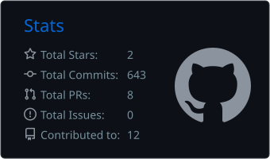
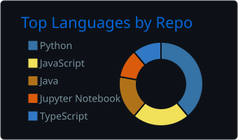
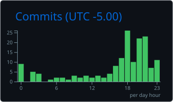
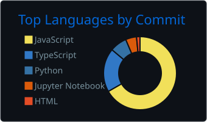

<div align="center">


<br>

<a href="https://rayanroshan.com"></a>
<a href="https://linkedin.com/in/rayan-roshan"></a>
<a href="mailto:2006rayanroshan@gmail.com"></a>

<br><br>

<picture>
  <source media="(prefers-color-scheme: dark)" srcset="https://raw.githubusercontent.com/Rayan-Roshan21/Rayan-Roshan21/output/snake-dark.svg" />
  <source media="(prefers-color-scheme: light)" srcset="https://raw.githubusercontent.com/Rayan-Roshan21/Rayan-Roshan21/output/snake-light.svg" />
  
</picture>

</div>

<br>

<details open>
<summary><code>$ whoami</code></summary>
<br>

|  |  |
|---|---|
| `role` | CS Co-op '29, Toronto Metropolitan University |
| `title` | VP of Technology, TMU BYTE |
| `team` | 13 engineers across backend, frontend, AI |
| `next` | Software Engineer, EY Digital Engineering |
| `focus` | AI infrastructure, developer tooling, fintech |

</details>

<details>
<summary><code>$ ls -la ~/projects</code></summary>
<br>

| | project | stack | status |
|---|---|---|---|
| 🟡 | **[nous](https://github.com/BYTE-TMU)** · decision intelligence engine | `next.js` `fastapi` `neo4j` `pgvector` | building |
| 🟢 | **[yapp](https://github.com/Rayan-Roshan21)** · campus discovery platform | `react` `flask` `mongodb` `vercel` | live |
| 🟡 | **agent-firewall** · security proxy for AI agents | `typescript` `node` `mcp` | mvp |
| 🟢 | **[smart-llm-router](https://www.npmjs.com/package/smart-llm-router)** · routes across 35+ models | `typescript` `npm` | published |
| 🟢 | **[askcents](https://github.com/Rayan-Roshan21/AskCents)** · AI finance wellness app | `react` `vite` `gemini` `plaid` | shipped |
| 🟢 | **[univ](https://github.com/Rayan-Roshan21/Univ)** · iOS admissions platform | `swift` `firebase` | shipped |

</details>

<details>
<summary><code>$ cat stack.txt</code></summary>
<br>
<div align="center">

[](#)
[](#)
[](#)

</div>
</details>

<details>
<summary><code>$ ./stats.sh</code></summary>
<br>
<div align="center">






</div>
</details>

<details>
<summary><code>$ git log --oneline -5</code></summary>
<br>

```console
f4c9a21  feat(nous): scope 16-week dual-track build
9b3e7d0  feat(yapp): ticketed registration flow
2a81f6c  feat(firewall): policy engine for MCP tool calls
7d40e15  chore: sign return offer, digital engineering
c15b902  docs: rewrite this readme as a terminal
```

</details>

<br>

<div align="center">

</div>
